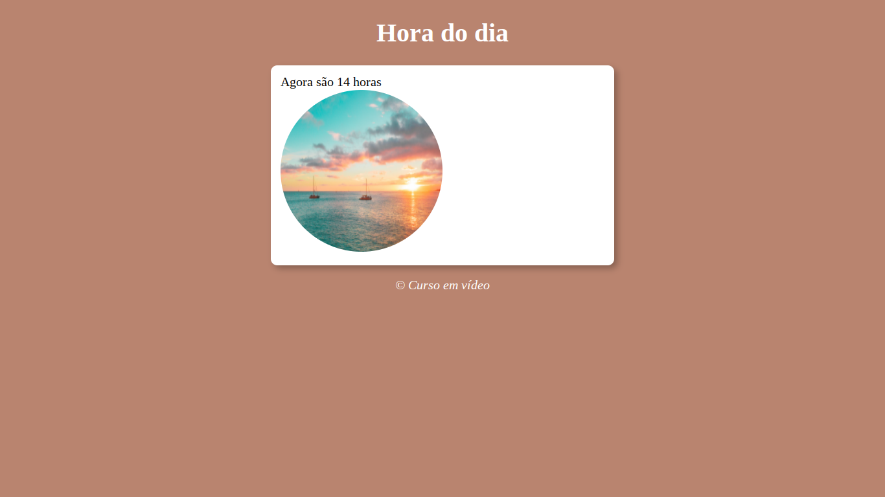

## 💻 O Projeto

Esse projeto foi desenvolvido durante um exercício prático, proposto pelo Gustavo Guanabara na plataforma Curso em Vídeo , durante Dezembro 08, 2021. 

## ✏️ Descrição

Essa ferramenta exibe a hora atual em tela.

## 🧪 Tecnologias usadas

Esse projeto foi desenvolvido usando as seguintes tecnologias
- [JavaScript](https://developer.mozilla.org/pt-BR/docs/Web/JavaScript)
- [HTML](https://www.w3.org/html/)
- [CSS](https://developer.mozilla.org/pt-BR/docs/Web/CSS)

---

Criado com 💜 por Maria Eduarda

 

